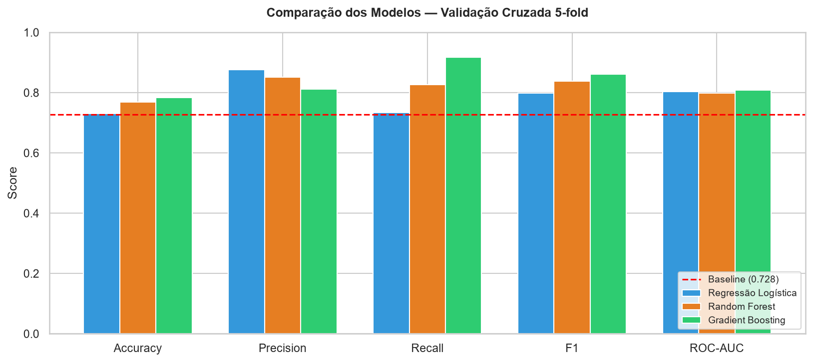
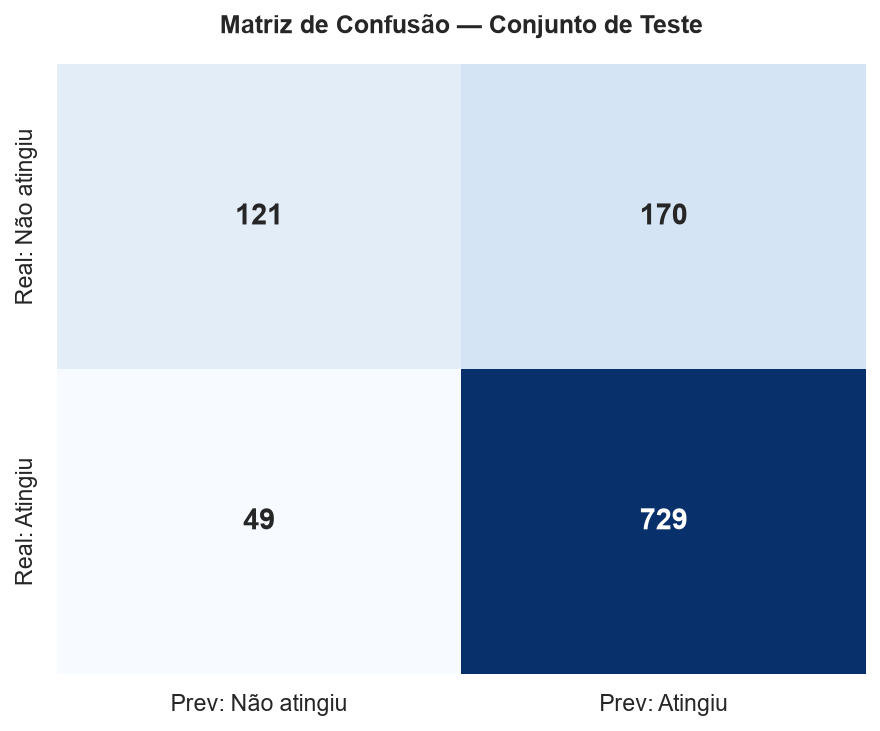
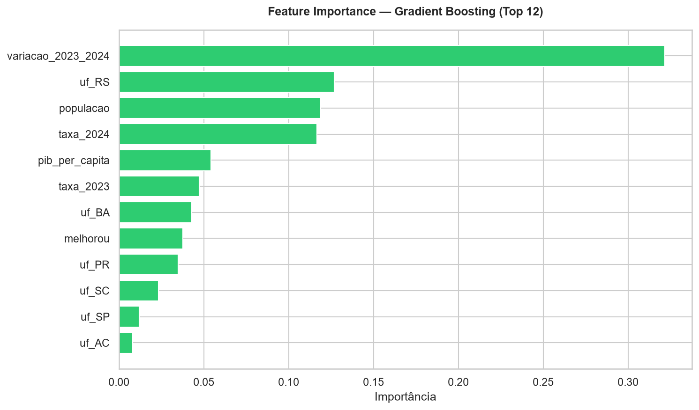
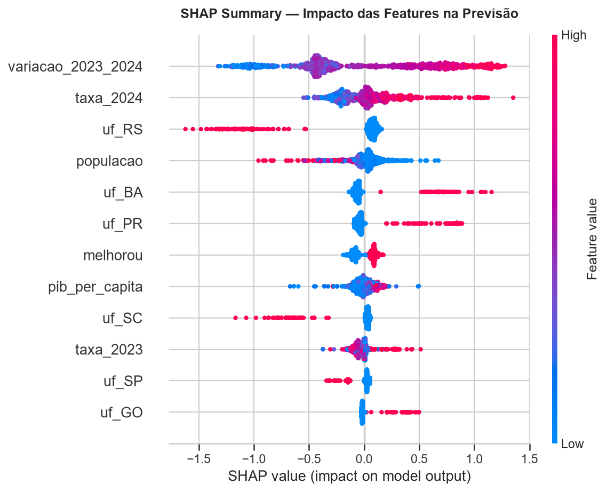
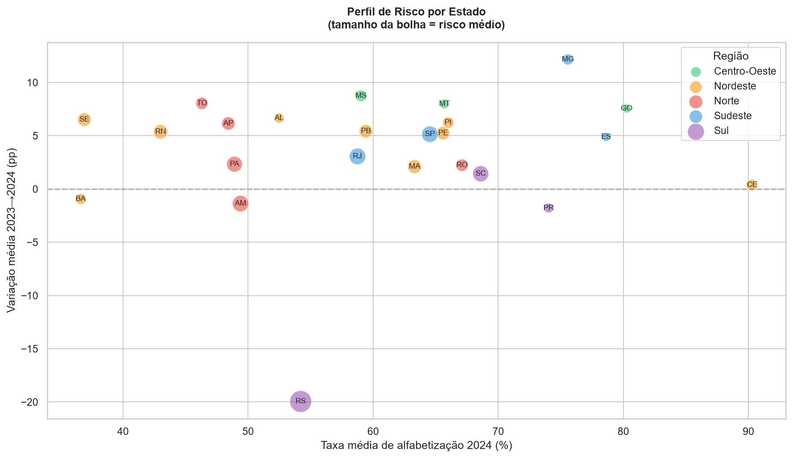
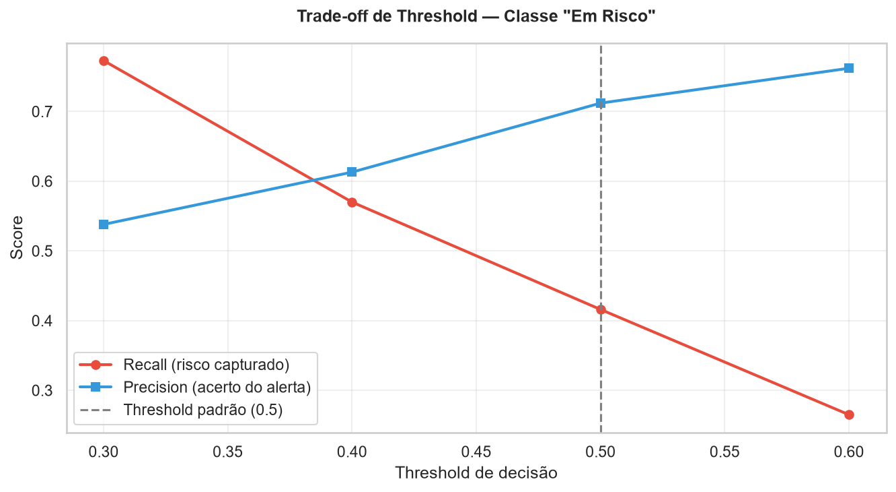

# Tech Challenge Fase 3 — Predição de Alfabetização Municipal

**Instituição:** FIAP PosTech
**Curso:** AI Scientist
**Aluno:** Guilherme Diniz Leocadio
**Fase:** 3 — Modelagem Supervisionada
**Repositório Fase 2:** https://github.com/GuilhermeDinizLeocadio/tech-challenge-fase2

---

## 1. Contexto e Objetivo

O **Compromisso Nacional Criança Alfabetizada** (Decreto nº 11.556/2023)
estabelece a meta de que todas as crianças brasileiras estejam alfabetizadas
até o final do 2º ano do ensino fundamental. Cada município tem uma **meta
anual pactuada**, e monitorar quem está no caminho de cumpri-la é essencial
para direcionar políticas públicas.

Este projeto constrói um **modelo supervisionado de classificação binária**
que prevê se um município **atingirá ou não sua meta de alfabetização**,
usando variáveis territoriais, socioeconômicas e histórico de desempenho.

**Pergunta central:** É possível prever, com dados disponíveis *antes* do
resultado, quais municípios correm risco de não cumprir a meta — permitindo
intervenção antecipada?

---

## 2. Definição do Alvo

| Item | Decisão |
|---|---|
| **Variável-alvo** | `atingiu_meta_2025` (binária) |
| **Classe 1** | Taxa INEP 2025 ≥ meta pactuada 2025 |
| **Classe 0** | Taxa INEP 2025 < meta pactuada 2025 |
| **Grão** | Um município por linha (rede pública total, `ID_TIPO_REDE=5`) |
| **N** | 5.342 municípios |
| **Balanceamento** | 72,8% classe 1 / 27,2% classe 0 |

**Justificativa:** o alvo se alinha diretamente à política pública (metas
oficiais pactuadas). A compatibilidade entre as escalas do INEP e da Base
dos Dados foi verificada empiricamente (correlação de 0,69 entre a taxa de
2024 e a de 2025).

**Enquadramento temporal:** o modelo é treinado com dados disponíveis até
2024 para prever o resultado de 2025, simulando a situação real de um gestor
que precisa antecipar o desfecho antes de ele ocorrer.

### Tratamento de Data Leakage

Foram **excluídas** da matriz de features todas as variáveis derivadas do
resultado de 2025:

- `PC_ALUNO_ALFABETIZADO` (taxa 2025) — é o próprio desfecho
- `meta_alfabetizacao_2025` — é o limiar que define o alvo
- Qualquer coluna calculada a partir delas

Adicionalmente, o pré-processamento é encapsulado num `Pipeline` do
Scikit-learn, de modo que imputação e padronização são **aprendidas apenas
no conjunto de treino** — impedindo vazamento por construção.

---

## 3. Fontes de Dados

| Fonte | Arquivo / API | Uso |
|---|---|---|
| INEP AEEB 2025 | `TS_MUNICIPIO.csv` | Taxa 2025 → **alvo** |
| Base dos Dados | `meta_municipio.csv` | Meta 2025 → **alvo** |
| Base dos Dados | `municipio.csv` | Taxa 2023/2024 → **features** |
| IBGE (API v3) | Agregado 6579 | População 2025 → **feature** |
| IBGE (API v3) | Agregado 5938 | PIB 2023 → **feature** |

A integração usa o **código IBGE de 7 dígitos** como chave. Os dados do IBGE
são obtidos via API pública, sem autenticação — garantindo reprodutibilidade.

### Features finais

| Feature | Tipo | Descrição |
|---|---|---|
| `taxa_2023` | numérica | Taxa de alfabetização em 2023 |
| `taxa_2024` | numérica | Taxa de alfabetização em 2024 |
| `variacao_2023_2024` | numérica | Tendência (2024 − 2023) |
| `melhorou` | binária | Flag de melhora |
| `populacao` | numérica | População estimada 2025 |
| `pib_per_capita` | numérica | PIB por habitante |
| `uf` | categórica | Estado (one-hot encoding) |

Após o pré-processamento, a matriz resultante tem **31 colunas**.

---

## 4. Análise Exploratória (EDA)

A EDA está documentada em `notebooks/01_eda.ipynb`.

### Principais observações

- **Distribuição do alvo:** desbalanceamento moderado (72,8% / 27,2%),
  tratável com `class_weight='balanced'` sem necessidade de oversampling.
- **Nulos:** `taxa_2023` apresenta 577 valores ausentes (10,8%), tratados
  por imputação com a mediana dentro do Pipeline.
- **Correlações com o alvo:** a variação 2023→2024 é a mais forte (+0,363),
  seguida de `melhorou` (+0,317) e `taxa_2024` (+0,209).
- **Correlação negativa inesperada:** `taxa_2023` correlaciona **negativamente**
  com o alvo (−0,092) — municípios com taxa alta receberam metas mais
  ambiciosas e têm mais dificuldade de cumpri-las.

### Hipóteses formuladas e seus desfechos

| # | Hipótese | Status final |
|---|---|---|
| H1 | Municípios com maior taxa em 2024 têm mais chance de atingir a meta | **Confirmada** (corr. +0,209) |
| H2 | Taxa alta em 2023 indica meta mais ambiciosa e menor chance de cumprimento | **Confirmada** (corr. −0,092) |
| H3 | A região/estado tem poder preditivo independente do histórico | **Confirmada** — `uf_RS` é a 2ª feature mais importante |
| H4 | Fatores socioeconômicos explicam variância residual | **Parcialmente** — correlação linear fraca, mas `populacao` e `pib_per_capita` contribuem via interações não-lineares |
| H5 | A tendência é mais preditiva que os valores absolutos | **Confirmada** — `variacao_2023_2024` é a feature mais importante do modelo (32,2%) |

A confirmação da **H5** foi o achado mais relevante da fase exploratória: a
feature de tendência, criada por engenharia de atributos a partir de dados já
disponíveis, mostrou-se mais preditiva que qualquer variável socioeconômica
coletada externamente.

---

## 5. Estrutura do Repositório


```
tech-challenge-fase3/
├── data/
│   ├── raw/                    # CSVs brutos (não versionados)
│   └── processed/              # base_modelagem.parquet (não versionada)
├── notebooks/
│   ├── 01_eda.ipynb            # Análise exploratória
│   └── 02_modeling.ipynb       # Modelagem, avaliação, interpretabilidade
├── src/
│   ├── preprocessing/
│   │   ├── build_base.py       # Constrói a base de modelagem
│   │   ├── enriquecer_ibge.py  # Busca dados da API do IBGE
│   │   ├── pipeline.py         # ColumnTransformer + split
│   │   └── checar_correlacao.py
│   ├── modeling/
│   │   └── train.py            # Treino, CV e otimização
│   ├── evaluation/
│   │   └── metrics.py          # Métricas, matriz de confusão, threshold
│   └── visualization/
│       └── plots.py            # Geração de figuras
├── models/                     # Modelo serializado (não versionado)
├── reports/
│   ├── figures/                # Visualizações geradas
│   └── metricas_finais.json
├── requirements.txt
├── README.md
└── .gitignore
```


---

## 6. Como Reproduzir

```bash
# 1. Clone o repositório
git clone https://github.com/GuilhermeDinizLeocadio/tech-challenge-fase3
cd tech-challenge-fase3

# 2. Crie e ative o ambiente virtual
python -m venv venv
venv\Scripts\activate      # Windows
source venv/bin/activate   # Linux/Mac

# 3. Instale as dependências
pip install -r requirements.txt

# 4. Coloque os CSVs brutos em data/raw/
#    (TS_MUNICIPIO.csv, meta_municipio.csv, municipio.csv)

# 5. Construa a base (inclui enriquecimento via API do IBGE)
python src/preprocessing/build_base.py

# 6. Treine o modelo
python src/modeling/train.py

# 7. Avalie o modelo
python src/evaluation/metrics.py

# 8. Gere as visualizações
python src/visualization/plots.py

# Alternativamente, execute os notebooks em ordem:
# notebooks/01_eda.ipynb → notebooks/02_modeling.ipynb
```

---

## 7. Etapas do Projeto

- [x] Etapa 1 — Entendimento do problema e setup
- [x] Etapa 2 — Análise Exploratória (EDA)
- [x] Etapa 3 — Pipeline de ML (Scikit-learn)
- [x] Etapa 4 — Treinamento e validação
- [x] Etapa 5 — Avaliação e interpretabilidade
- [x] Etapa 6 — Aplicação estratégica
- [x] Etapa 7 — Entregáveis finais

---

## 8. Algoritmos Avaliados

Três algoritmos foram comparados via **validação cruzada estratificada
(5-fold)** no conjunto de treino:

| Modelo | Accuracy | Precision | Recall | F1 | ROC-AUC |
|---|---|---|---|---|---|
| Regressão Logística | 0,731 | 0,876 | 0,735 | 0,799 | 0,803 |
| Random Forest | 0,768 | 0,851 | 0,826 | 0,838 | 0,798 |
| **Gradient Boosting** | **0,784** | 0,811 | **0,917** | **0,861** | **0,808** |
| *Baseline (classe majoritária)* | *0,728* | — | — | — | — |



**Modelo escolhido: Gradient Boosting** — melhor F1 (equilíbrio entre
precision e recall), melhor ROC-AUC e maior estabilidade entre folds
(desvio-padrão de ±0,010).

### Otimização de hiperparâmetros

`GridSearchCV` com 18 combinações × 5 folds, otimizando F1:

| Hiperparâmetro | Valor escolhido |
|---|---|
| `learning_rate` | 0,05 |
| `max_depth` | 4 |
| `n_estimators` | 100 |

O ganho foi marginal (F1 de 0,861 → 0,865), indicando que o teto de
performance vem dos **dados**, não da configuração do modelo. Os parâmetros
escolhidos são conservadores (árvores rasas, aprendizado lento), o que
favorece a generalização e controla overfitting.

---

## 9. Métricas de Avaliação

Avaliação final no **conjunto de teste** (1.069 municípios nunca vistos):

| Métrica | Valor |
|---|---|
| Accuracy | 0,795 |
| Precision | 0,811 |
| Recall | 0,937 |
| F1-Score | 0,869 |
| ROC-AUC | 0,829 |
| *Baseline* | *0,728* |

### Matriz de confusão



|  | Prev: Não atingiu | Prev: Atingiu |
|---|---|---|
| **Real: Não atingiu** | 121 | **170** |
| **Real: Atingiu** | 49 | 729 |

### Desempenho por classe

| Classe | Precision | Recall | F1 | Suporte |
|---|---|---|---|---|
| Não atingiu (0) | 0,71 | **0,42** | 0,52 | 291 |
| Atingiu (1) | 0,81 | 0,94 | 0,87 | 778 |

**Achado central:** o modelo é excelente em identificar municípios que
**atingem** a meta (recall 0,94), mas captura apenas **42%** dos municípios
que **não atingem** — justamente a classe de maior interesse para política
pública. Os 170 falsos negativos da matriz de confusão representam municípios
em risco real que não seriam sinalizados para intervenção.

---

## 10. Interpretação do Modelo

### Feature Importance



| Feature | Importância |
|---|---|
| `variacao_2023_2024` | 32,2% |
| `uf_RS` | 12,7% |
| `populacao` | 11,9% |
| `taxa_2024` | 11,7% |
| `pib_per_capita` | 5,4% |

A importância está **distribuída** entre múltiplas features — nenhuma domina
isoladamente, o que corrobora a ausência de leakage.

### SHAP Values



O SHAP confirma a **direção** dos efeitos:

- **Variação positiva** (município melhorando) → empurra para "atingiu"
- **Pertencer ao RS** → forte empurrão para "não atingiu"
- **Pertencer a BA ou PR** → empurra para "atingiu"
- **Taxa 2024 alta** → empurra para "atingiu"

---

## 11. Principais Insights

### 1. A trajetória importa mais que o patamar

A feature mais preditiva não é a taxa absoluta de alfabetização, mas a
**variação entre 2023 e 2024**. Municípios em trajetória de melhora tendem
a cumprir a meta independentemente de onde partiram.

### 2. O paradoxo das metas ambiciosas

Estados com boas taxas absolutas (Sul e Sudeste) têm **pior desempenho no
cumprimento de metas** — porque suas metas pactuadas são proporcionalmente
mais exigentes.

| Região | % que atingiu a meta | Taxa média 2024 |
|---|---|---|
| Centro-Oeste | 91,4% | 72,2% |
| Nordeste | 78,8% | 56,7% |
| Norte | 71,8% | 50,2% |
| Sudeste | 71,8% | 70,5% |
| Sul | **57,0%** | 64,8% |

### 3. O Rio Grande do Sul é um outlier



O RS apresenta variação média de **−19,95 pontos percentuais** entre 2023 e
2024, enquanto quase todos os demais estados melhoraram. Consequentemente,
**86,5% dos seus municípios** são classificados em risco, e os 20 municípios
de maior risco do país são todos gaúchos.

> **Nota metodológica:** uma queda de ~20 pp em um único ano é atípica e pode
> refletir mudança na metodologia de aferição do estado, não apenas piora
> real. Recomenda-se investigação específica antes de conclusões definitivas.

### 4. O limiar de decisão é uma escolha de política pública



| Threshold | Recall (risco capturado) | Precision |
|---|---|---|
| 0,30 | **77,3%** | 53,8% |
| 0,40 | 57,0% | 61,3% |
| 0,50 (padrão) | 41,6% | 71,2% |
| 0,60 | 26,5% | 76,2% |

Reduzir o limiar de 0,50 para 0,30 quase **dobra** a identificação de
municípios em risco (42% → 77%), ao custo de mais falsos alarmes. Como o
custo social de não identificar um município em risco supera o de revisar um
município que estava bem, recomenda-se operar com limiar reduzido.

---

## 12. Aplicação para Políticas Públicas

**Uso recomendado:** o modelo deve ser empregado como **ferramenta de
triagem**, não de decisão final. Ele prioriza onde a atenção do gestor deve
começar, com base numa probabilidade de risco calculada por município.

**Recomendações concretas:**

1. **Priorizar municípios em trajetória de queda** — a variação anual é o
   sinal mais forte de risco, mais que o patamar absoluto.
2. **Atenção especial ao Rio Grande do Sul** — concentra os municípios de
   maior risco, com queda anômala que merece investigação.
3. **Operar com limiar reduzido (0,30)** — para maximizar a captura de
   municípios em risco, aceitando revisar alguns falsos positivos.
4. **Revisar a calibragem das metas** — o paradoxo identificado sugere que
   metas proporcionalmente mais duras para estados já bem posicionados podem
   desestimular em vez de impulsionar.

---

## 13. Limitações e Evoluções Futuras

### Limitações

**Poder preditivo modesto para a classe de risco.** O recall de 0,42 na
classe "não atingiu" indica que as features disponíveis não capturam bem os
determinantes do fracasso. O modelo é mais confiável para confirmar sucesso
que para prever fracasso.

**Ausência de dados de investimento educacional.** O FUNDEB seria uma feature
conceitualmente ideal (é a única variável diretamente acionável por gestores),
mas o valor-aluno é definido em **âmbito estadual**, tornando-o redundante com
a variável `uf`. Os dados de gasto municipal efetivo (SIOPE) não possuem
acesso programático reprodutível.

**Ausência de IDHM.** O Atlas do Desenvolvimento Humano disponibiliza download
estruturado apenas do IDHM de 2010 (Censo). A versão mais recente (PNAD
2022–2024) existe, mas está restrita a portal interativo sem API. Além disso,
a dimensão educação do IDHM exigiria cuidado para evitar circularidade.

**Série temporal curta.** Apenas três pontos no tempo (2023, 2024, 2025)
limitam a modelagem de tendências mais sofisticadas.

**Anomalia do RS.** A queda atípica do estado pode estar distorcendo o modelo,
que aprendeu "ser do RS" como forte preditor de risco.

### Evoluções futuras

1. **Integrar IDHM** (dimensões renda e longevidade, evitando a dimensão
   educação) caso dados municipais recentes se tornem disponíveis por API.
2. **Dados de infraestrutura escolar** (Censo Escolar): número de escolas,
   formação docente, relação aluno/professor.
3. **Investigar a anomalia do RS** e, se confirmada como artefato metodológico,
   tratá-la ou excluí-la da modelagem.
4. **Ampliar a série temporal** conforme novos anos do indicador forem
   publicados, permitindo modelos de séries temporais.
5. **Técnicas de balanceamento** (SMOTE, undersampling) voltadas
   especificamente a elevar o recall da classe de risco.

---

*FIAP PosTech — AI Scientist — Tech Challenge Fase 3*